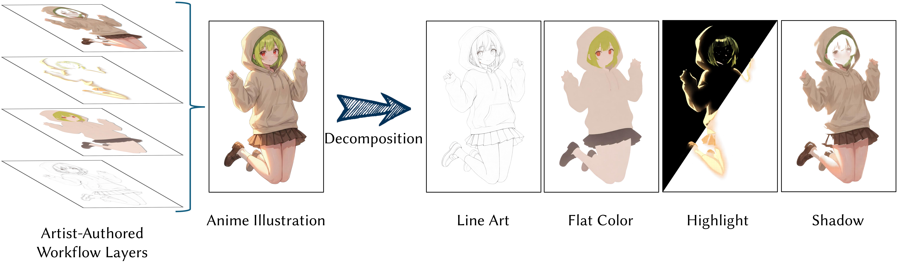

<p align="center">
  <h1 align="center">Workflow-Aware Structured Layer Decomposition for Illustration Production</h1>
  <p align="center">
    <a href="https://zty0304.github.io/">Tianyu Zhang</a><sup>1</sup>,
    <a>Dongchi Li</a><sup>2</sup>,
    <a>Keiichi Sawada</a><sup>2</sup>,
    <a href="https://www.jaist.ac.jp/~xie/">Haoran Xie</a><sup>1,3</sup>
  </p>
  <p align="center">
    <sup>1</sup> Japan Advanced Institute of Science and Technology (JAIST)
  </p>
  <p align="center">
    <sup>2</sup> Live2D Inc.
  </p>
  <p align="center">
    <sup>3</sup> Waseda University,
  </p>
  <p align="center">
    <a href='https://arxiv.org/abs/2603.14925'>
      
    </a>
  <a href='https://github.com/zty0304/Anime-layer-decomposition'>
    
  </a>
  <a href='#'>
    
  </a>
  </p>
</p>


<p align="center">
  
</p>
Our framework decomposes anime illustrations into four layers, including line art, flat color, highlight, and shadow layers, to align with professional creation workflow.

<h3 align="center">Abstract</h3>

Recent generative image editing methods adopt layered representations to mitigate the entangled nature of raster images and improve controllability, typically relying on object-based segmentation. However, such strategies may fail to capture the structural and stylized properties of human-created images, such as anime illustrations. To solve this issue, we propose a workflow-aware structured layer decomposition framework tailored to the illustration production of anime artwork. Inspired by the creation pipeline of anime production, our method decomposes the illustration into semantically meaningful production layers, including line art, flat color, shadow, and highlight. To decouple all these layers, we introduce lightweight layer semantic embeddings to provide specific task guidance for each layer. Furthermore, a set of layer-wise losses is incorporated to supervise the training process of individual layers. To overcome the lack of ground-truth layered data, we construct a high-quality illustration dataset that simulated the standard anime production workflow. Experiments demonstrate that the accurate and visually coherent layer decompositions were achieved by using our method. We believe that the resulting layered representation further enables downstream tasks such as recoloring and embedding texture, supporting content creation, and illustration editing.

<h3 align="center">Framework</h3>

<p align="center">
  
</p>
Overview of our anime illustration decomposition framework. (a) We enhance the <a href="https://huggingface.co/Qwen/Qwen-Image-Layered">Qwen-Image-Layered</a> with layer semantic embeddings and a multi-faceted Layer-wise supervision loss, to improve disentanglement and rendering quality.

<h3 align="center">Dataset</h3>

<p align="center">
  
</p>

We have compiled a high-quality anime illustration dataset with layered annotations. Each sample consists of (a) a source image and its manually decomposed layers, including (b) line art, (c) flat color, (d) highlight, and (e) shadow. 

All data are produced by two experienced artists, where one artist is responsible for layer creation and the other performs supervision and quality refinement.

<h3 align="center">Results</h3>

<p align="center">
  
</p>
Some results of our method. Our method is capable of generating various functional layers utilized in the professional illustration workflow.

<h3 align="center">Applications</h3>

<p align="center">
  
</p>
Our decomposed layers allow for precise control over surface attributes like light hue and material textures.

# BibTeX
If you find Project Name useful for your work please cite:
```
@article{zhang2026workflow,
  title={Workflow-Aware Structured Layer Decomposition for Illustration Production},
  author={Zhang, Tianyu and Li, Dongchi and Sawada, Keiichi and Xie, Haoran},
  journal={arXiv preprint arXiv:2603.14925},
  year={2026}
}
```
